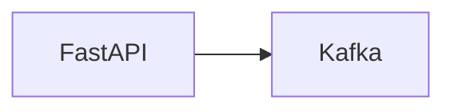
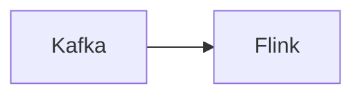

# Real-Time Analytics Pipeline with Kafka & Flink 


This project is part of a multi-phase journey to build a scalable event processing system demonstrating real-time aggregations using modern streaming technologies.


## Tech Stack
| Component       | Purpose                          |
|-----------------|----------------------------------|
| Apache Flink    | Stream processing engine         |
| PyFlink         | Python API for Flink             |
| Kafka           | Distributed event streaming      |
| Docker Compose  | Container orchestration          |

## Phase 1: Event Ingestion with Kafka



- FastAPI `/track` endpoint receives events
- Kafka producer sends events
- Kafka consumer logs events
- Docker Compose for Kafka & Zookeeper setup

<details> <summary style="font-size: 1.2em; font-weight: bold; cursor: pointer;">Setup Instructions</summary>

```bash
# Start core services
docker-compose up -d

# Create Kafka topic (in new terminal)
python track_service/admin.py

# Start FastAPI producer (in new terminal)
uvicorn track_service.main:app --reload

# Start consumer service (in new terminal)
python consumer_service/consumer.py
```

Components:
1. **FastAPI Producer**: http://localhost:8000/docs (Swagger UI)
2. **Kafka Broker**: localhost:9092
3. **Consumer Service**: Outputs raw events to console
</details>


## Phase 2: Stream Processing with Flink



- Added PyFlink job to consume and process events from Kafka
- Performs sliding window aggregation:
  - Aggregates by `event_id` over a **30s window** sliding every **10s**
  - Computes total event count and sum of `value`
- Watermarking to handle out-of-order events (5s tolerance)
- Results printed to stdout (can be redirected to sinks in future)
- Kafka topic is created automatically if it doesn’t exist

<details> <summary style="font-size: 1.2em; font-weight: bold; cursor: pointer;">Setup Instructions</summary>

```bash
docker-compose up --build
````

This:

1. Starts Zookeeper, Kafka, Flink JobManager & TaskManager
2. Creates the Kafka topic `flink-events` if it doesn't exist
3. Launches a PyFlink streaming job that:

   * Reads from Kafka
   * Parses, validates, aggregates, and prints event metrics

Use `producer.py` (or the FastAPI tracker from Phase 1) to send test events.
</details>

## Next: Phase 3
- I'm going to be using Redis to store aggregated results for low-latency queries
