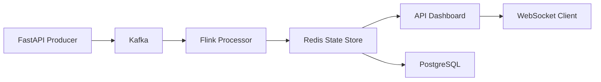
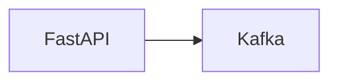
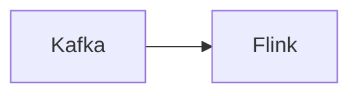
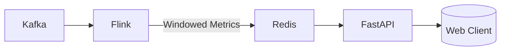
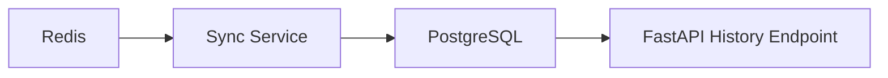
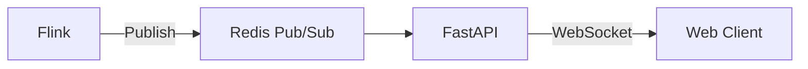

# Real-Time Analytics Pipeline with Kafka & Flink 


This project is part of a multi-phase journey to build a scalable event processing system demonstrating real-time aggregations using modern streaming technologies.



## Tech Stack
| Component       | Phase | Purpose                          |
|-----------------|-------|----------------------------------|
| Apache Flink    | 2-5   | Stateful stream processing       |
| Redis           | 3-5   | Low-latency metrics storage      |
| FastAPI         | 1,3-5 | Ingestion & insights API         |
| Kafka           | 1-5   | Distributed event bus            |
| PostgreSQL      | 4-5   | Long-term metrics storage        |
| Docker Compose  | All   | Environment orchestration        |
| WebSockets      | 5     | Real-time dashboard updates      |

---

## Phase 1: Event Ingestion with Kafka



- FastAPI `/track` endpoint receives events
- Kafka producer sends events
- Kafka consumer logs events
- Docker Compose for Kafka & Zookeeper setup

<details>
<summary><strong>Setup Instructions</strong></summary>

```bash
# Start core services
docker-compose up -d

# Create Kafka topic (in new terminal)
python track_service/admin.py

# Start FastAPI producer (in new terminal)
uvicorn track_service.main:app --reload

# Start consumer service (in new terminal)
python consumer_service/consumer.py
```

Components:
1. **FastAPI Producer**: http://localhost:8000/docs (Swagger UI)
2. **Kafka Broker**: localhost:9092
3. **Consumer Service**: Outputs raw events to console
</details>


## Phase 2: Stream Processing with Flink



- Added PyFlink job to consume and process events from Kafka
- Performs sliding window aggregation:
  - Aggregates by `event_id` over a **30s window** sliding every **10s**
  - Computes total event count and sum of `value`
- Watermarking to handle out-of-order events (5s tolerance)
- Results printed to stdout (can be redirected to sinks in future)
- Kafka topic is created automatically if it doesn’t exist

<details>
<summary><strong>Setup Instructions</strong></summary>

```bash
docker-compose up --build
````

This:

1. Starts Zookeeper, Kafka, Flink JobManager & TaskManager
2. Creates the Kafka topic `flink-events` if it doesn't exist
3. Launches a PyFlink streaming job that:

   * Reads from Kafka
   * Parses, validates, aggregates, and prints event metrics

Use `producer.py` (or the FastAPI tracker from Phase 1) to send test events.
</details>

## Phase 3: Real-Time Cache with Redis



- Kafka receives incoming event streams.
- PyFlink consumes and processes these streams, applying sliding window aggregation.
- Aggregated metrics are stored in Redis sorted sets.
- A FastAPI service exposes these metrics via a `/metrics` HTTP endpoint.

<details> 
<summary><strong>Setup Instructions</strong></summary>

```bash
# Copy environment template
cp .env.example .env

# Start all services
docker-compose up -d --build

# Generate test data
docker-compose exec flink_service python src/jobs/producers/metric_producer.py
```

**Access Services**:
- FastAPI Docs: http://localhost:8000/docs
- Flink Dashboard: http://localhost:8081
- Redis CLI: `docker exec -it phase3-redis-1 redis-cli -a redispass`

**Sample Query**:
```bash
curl "http://localhost:8000/metrics/metrics?event_type=click&window_size=30s"
```
</details>
<details>
<summary><strong>API Endpoints</strong></summary>

### Get Metrics
```http
GET /metrics?event_type={type}&window_size={size}&limit={n}
```

**Response**:
```json
{
  "event_type": "click",
  "window_size": "30s",
  "entries": [
    {
      "window_start": 1719392400000,
      "count": 142,
      "total_value": 8563.21,
      "unique_users": 23
    }
  ]
}
```
</details>

## Phase 4: Long-Term Storage with PostgreSQL



- **PostgreSQL** for persistent metric storage
- **Sync Service** that periodically:
  - Reads aggregated metrics from Redis
  - Writes to PostgreSQL
  - Cleans processed metrics from Redis
- **New FastAPI Endpoints**:
  - `/metrics/realtime` - Current window from Redis
  - `/metrics/history` - Historical data from PostgreSQL

<details>
<summary><strong>Setup Instructions</strong></summary>

```bash
# Copy environment template
cp .env.example .env

# Start all services
docker-compose up -d --build

# Generate test data (in Flink service)
docker-compose exec flink_service python src/jobs/producers/metric_producer.py

# Verify PostgreSQL data
docker-compose exec postgres psql -U admin -d analytics -c "SELECT * FROM metrics LIMIT 5;"
```

**Access Services**:
- FastAPI Docs: http://localhost:8000/docs
- PostgreSQL: `docker-compose exec postgres psql -U admin analytics`
- Sync Service Logs: `docker-compose logs -f sync_service`
</details>

<details>
<summary><strong>API Endpoints</strong></summary>

### Get Real-Time Metrics
```http
GET /metrics/realtime?event_type={type}&window_size={size}&limit={n}
```

### Get Historical Metrics
```http
GET /metrics/history?event_type={type}&window_size={size}&start_time={iso}&end_time={iso}&limit={n}
```

**Response**:
```json
{
  "event_type": "click",
  "window_size": "30s",
  "entries": [
    {
      "window_start": 1719392400000,
      "count": 142,
      "total_value": 8563.21,
      "unique_users": 23
    }
  ]
}
```
</details>

## Phase 5: Real-Time Dashboard with WebSockets



- Added WebSocket endpoint at `/live-metrics`
- Flink publishes metric updates to Redis Pub/Sub channel
- FastAPI forwards updates to connected WebSocket clients
- Enables live dashboard updates without polling

<details>
<summary><strong>Dashboard Preview</strong></summary>

The dashboard provides real-time visualization of key metrics:

- Live Activity Feed: Shows events as they're processed

- Metric Cards: Display current counts, and unique users

- Time-Series Charts: Visualize trends over 30-second windows

- Event Type Filter: Focus on specific event categories
</details>


<details>
<summary><strong>Setup Instructions</strong></summary>

```bash
# Start all services
docker-compose up -d --build

# Generate test data
docker-compose exec flink_service python src/jobs/producers/metric_producer.py

# Connect to WebSocket (use client like wscat):
wscat -c ws://localhost:8000/live-metrics
```

**Access Services**:
- WebSocket endpoint: `ws://localhost:8000/live-metrics`
- Real-time updates visible in WebSocket client
- Static dashboard files: http://localhost:8000/static/index.html

**Sample Message**:
```json
{
  "window_start": 1719392400000,
  "window_end": 1719392430000,
  "count": 142,
  "total_value": 8563.21,
  "unique_users": 23,
  "event_type": "click",
  "window_size": "30s"
}
```
</details>

<details>
<summary><strong>API Endpoints</strong></summary>

### Get Real-Time Metrics (HTTP)
```http
GET /metrics/realtime?event_type={type}&window_size={size}&limit={n}
```

### Get Historical Metrics
```http
GET /metrics/history?event_type={type}&window_size={size}&start_time={iso}&end_time={iso}&limit={n}
```

### Real-Time Stream (WebSocket)
```http
GET /live-metrics
```

**WebSocket Message Format**:
```json
{
  "window_start": 1719392400000,
  "window_end": 1719392430000,
  "count": 142,
  "total_value": 8563.21,
  "unique_users": 23,
  "event_type": "click",
  "window_size": "30s"
}
```
</details>

---

## Complete System Architecture

The final system demonstrates an event processing pipeline:

1. **Event Ingestion**: FastAPI receives events and pushes to Kafka
2. **Stream Processing**: Flink processes events with sliding window aggregation
3. **Real-Time Storage**: Redis stores current metrics with TTL
4. **Live Streaming**: WebSocket clients receive instant updates via Redis pub/sub
5. **Historical Storage**: PostgreSQL persists metrics for long-term analysis
6. **Data Synchronization**: Sync service moves data from Redis to PostgreSQL
